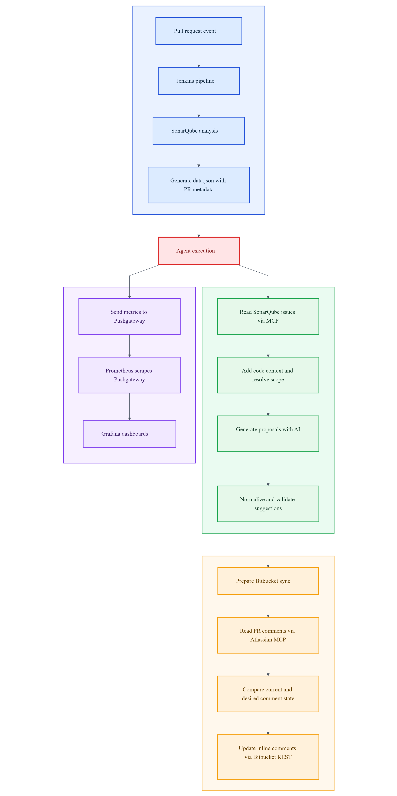

# CodeGuardian

CodeGuardian is the system developed for the final degree project. Its objective is to combine static analysis, CI/CD automation and AI assistance in the pull request review process.

The system does not use the AI model as the only source of truth. First, SonarQube detects issues in the target repository. After that, the CodeGuardian agent reads those findings, prepares the code context, asks the AI model for possible fixes, validates the generated suggestions and publishes the final feedback as inline comments in Bitbucket.

CodeGuardian can also run an optional optimization review mode that is separate from defect detection. This mode focuses on changed functions, methods and selected build/configuration files where Gemini can justify a safer change that reduces runtime, build time, repeated IO/network/database work, memory pressure or algorithmic cost.

This repository, `codeguardian-core`, contains the main agent logic. At the same time, its README acts as the global entry point for the whole project because the agent is the central element of the system.

## Project Repositories

The project is divided into three repositories:

| Repository | Responsibility |
| --- | --- |
| `codeguardian-core` | Main Python agent and technical documentation |
| `codeguardian-infra` | Local infrastructure for Jenkins, SonarQube, Prometheus, Pushgateway and Grafana |
| `app-demo` | Demo repository used to show the workflow with a controlled target project |

## Important Clarification About app-demo

`app-demo` is not the only intended target of CodeGuardian. It is only a controlled repository used for demonstration, testing and presentation.

The real goal of CodeGuardian is to analyse different repositories in a CI/CD environment, as long as the required execution context is available:

- a pull request in Bitbucket,
- a Jenkins pipeline,
- SonarQube analysis,
- repository access from the agent,
- the expected PR metadata JSON contract.

For this reason, the core logic and the current unit tests are designed to be generic and not coupled to `app-demo`.

## Repository Structure

| Path | Purpose |
| --- | --- |
| `agent.py` | Compatibility entrypoint used by Jenkins and local executions |
| `codeguardian/runtime.py` | Runtime implementation of the agent |
| `codeguardian/models.py` | Data models and custom exceptions |
| `codeguardian/config.py` | Constants, environment configuration and cache helpers |
| `codeguardian/text.py` | File reading, text normalization, language detection and scope helpers |
| `codeguardian/validation.py` | Issue normalization and patch validation helpers |
| `codeguardian/comments.py` | Comment formatting and hidden metadata helpers |
| `codeguardian/input_contract.py` | Pipeline input JSON parsing |
| `codeguardian/sonarqube.py` | SonarQube result parsing and retrieval helpers |
| `codeguardian/ai.py` | AI batching, cache and generation helpers |
| `codeguardian/diff.py` | Shared git diff helpers for pull request scope detection |
| `codeguardian/performance.py` | Optional optimization review mode |
| `codeguardian/bitbucket.py` | Bitbucket REST and comment synchronization helpers |
| `codeguardian/cli.py` | Command-line entrypoint helper |
| `docs/` | Architecture, pipeline, validation, synchronization and metrics documentation |
| `docs/copilot-mcp.md` | Copilot MCP integration guide |
| `requirements.txt` | Python dependencies for runtime and testing |
| `tests/` | Unit tests for internal agent behaviour |

## How The Three Repositories Work Together

### codeguardian-core

This repository contains the Python agent that orchestrates the review process. The root `agent.py` file is kept as a stable entrypoint, while the code is exposed through the `codeguardian/` package to make the project easier to understand and evolve.

Its main responsibilities are:

- reading pull request metadata from Jenkins,
- retrieving SonarQube issues,
- filtering and normalising findings,
- resolving code scope,
- grouping findings before sending them to the model,
- optionally reviewing changed scopes for optimization opportunities,
- validating generated code replacements,
- synchronising inline comments in Bitbucket,
- exporting execution metrics.

### codeguardian-infra

This repository provides the Docker-based local environment used to run the system end to end.

It includes:

- Jenkins with Blue Ocean,
- SonarQube Community,
- Prometheus,
- Pushgateway,
- Grafana,
- a custom Jenkins image with Java, Python, Node and analysis tools.

Its purpose is to make the project reproducible and demonstrable.

### app-demo

This repository is a Java project used as a demonstration target.

It intentionally contains different quality problems so that SonarQube can detect findings and CodeGuardian can publish comments in a realistic pull request workflow.

Even if `app-demo` is useful for the demo, the system is not limited to this repository. Another repository can be analysed if it can be processed by the same CI/CD and SonarQube pipeline model.

## Global Execution Flow

The expected end-to-end flow is:

```text
1. A developer opens a pull request in a target repository.
2. Bitbucket triggers the Jenkins pipeline.
3. Jenkins checks out the pull request code.
4. Jenkins runs SonarQube analysis.
5. Jenkins creates a JSON file with pull request metadata.
6. Jenkins executes the CodeGuardian agent.
7. The agent retrieves SonarQube issues.
8. The agent prepares code context and groups findings.
9. The AI model generates possible fix suggestions.
10. If enabled, the agent reviews changed functions, methods and selected build/configuration files for optimization opportunities.
11. The agent validates the generated replacements.
12. Valid suggestions are published as inline comments in Bitbucket.
13. Execution metrics are pushed to Pushgateway.
14. Prometheus and Grafana expose the metrics.
```

## Core Design

The system clearly separates detection, generation and publication:

- SonarQube detects problems.
- The agent decides what to process and validates the results.
- AI proposes concrete code changes and optional non-blocking optimization suggestions.
- Bitbucket displays the final feedback inside the pull request.

This separation reduces operational risk compared to a direct LLM-only approach without validation barriers.

## JSON Contracts

CodeGuardian uses two different JSON contracts.

### 1. Pipeline input JSON

This JSON is created by Jenkins and consumed by the agent.

Required fields:

- `project_key`
- `pr_id`
- `repo_slug`
- `workspace`

Example:

```json
{
  "project_key": "my-project",
  "pr_id": "123",
  "repo_slug": "my-repo",
  "workspace": "my-workspace"
}
```

### 2. SonarQube findings JSON

The agent invokes the SonarQube MCP tool and receives findings as JSON. The agent then parses, cleans and prioritises that payload before calling the model.

## Bitbucket Integration

Bitbucket integration is split by responsibility:

- pull request comment reading: Atlassian Rovo MCP,
- inline comment creation and deletion: Bitbucket REST API.

This mixed model is used to keep better control over the inline comment lifecycle.

## Reliability Mechanisms

The agent includes safety barriers before publishing suggestions:

- strict prompt and response-format rules,
- issue normalization and deduplication,
- applicability check: `original_code` must match the real repository content,
- Python syntax validation with `ast.parse()`,
- Maven compile validation with `mvn compile` when a `pom.xml` file exists,
- incremental comment synchronization using content signatures.

These mechanisms do not guarantee perfect correctness, but they reduce the probability of publishing invalid suggestions.

## Optional Optimization Review

The optimization review is disabled by default and can be enabled per pipeline or per repository:

```text
CODEGUARDIAN_ENABLE_OPTIMIZATION_REVIEW=true
CODEGUARDIAN_OPTIMIZATION_MAX_SCOPES=10
CODEGUARDIAN_OPTIMIZATION_REQUIRE_CLEAR_GAIN=true
CODEGUARDIAN_OPTIMIZATION_CONTEXT_WINDOW=20
```

The previous `CODEGUARDIAN_ENABLE_PERFORMANCE_REVIEW`, `CODEGUARDIAN_PERFORMANCE_MAX_SCOPES`, `CODEGUARDIAN_PERFORMANCE_MIN_COMPLEXITY_GAIN` and `CODEGUARDIAN_PERFORMANCE_CONTEXT_WINDOW` names remain supported for existing pipelines.

This mode analyses only changed pull request scopes. Candidate scopes are functions or methods resolved from changed lines in the diff, plus selected build/configuration files such as `Jenkinsfile`, `pom.xml`, `build.gradle`, `package.json`, Docker and CI files. Generated files, dependency folders, build folders, caches and common test paths are excluded conservatively.

Gemini is asked for at most one optimization suggestion per candidate. A suggestion must include the detected runtime/build problem, current estimated time/space or build/runtime cost, proposed estimated cost, a justification and direct replacement code. Suggestions still pass the same normalization, patch applicability and Python syntax validation barriers before Bitbucket publication.

This is a best-effort code review signal, not a replacement for benchmarks, profiling, compilation or tests.

The token cost is controlled by:

- limiting the number of changed files sent to the model,
- limiting the number of optimization scopes,
- validating that proposed replacements match the current file before publication.

## Copilot MCP

CodeGuardian exposes an optional read-only MCP server for GitHub Copilot Business or Enterprise. It lets Copilot query SonarQube findings, Bitbucket CodeGuardian comments, Prometheus metrics and Jenkins build summaries from the local infrastructure.

The server is documented in `docs/copilot-mcp.md` and is intended as a support interface for the TFG workflow. It does not modify repositories, pull requests, Jenkins jobs or SonarQube projects.

## Observability

Analysis metrics are exported to Pushgateway, including:

- analysis latency,
- prompt tokens,
- response tokens,
- total tokens,
- cached tokens,
- cache hits and misses,
- SonarQube findings,
- generated, dropped and final issues,
- Bitbucket comments created, reused and deleted,
- last execution timestamp.

In addition, the agent logs:

- cache behaviour,
- validation summary,
- inline synchronization summary.

This makes the execution easier to monitor, evaluate and troubleshoot across builds.

## Runtime Requirements

Main environment variables:

- `SONARQUBE_AUTH_TOKEN`
- `LLM_AUTH_TOKEN`
- `BITBUCKET_EMAIL`
- `BITBUCKET_API_TOKEN`
- `ATLASSIAN_MCP_AUTH_HEADER`

Additional optional variables are available for cache configuration, endpoints, grouping behaviour and optimization review.

## Minimal Agent Invocation

This is a minimal invocation example, not a full local quickstart. Successful execution still depends on valid credentials, reachable SonarQube and Bitbucket services, working MCP and REST integrations, and a repository context that matches the provided PR metadata.

1. Install dependencies from `requirements.txt`.
2. Configure required environment variables.
3. Create the pull request input JSON.
4. Run the agent entry point.

## Tests

The repository includes a first unit test suite focused on the internal behaviour of the agent. These tests do not depend on Jenkins, Bitbucket, SonarQube or a specific demo repository.

Run the tests with:

```bash
pytest -q
```

Current test coverage:

- `tests/test_language_detection.py`: checks language detection from file extensions for different ecosystems.
- `tests/test_text_normalization.py`: checks cleanup of generated code text and normalization of code blocks before comparison.
- `tests/test_input_contract.py`: checks the Jenkins-to-agent JSON input contract and default workspace handling.
- `tests/test_issue_normalization.py`: checks issue cleanup, severity normalization, line-range correction, deduplication and fallback issue keys.
- `tests/test_patch_validation.py`: checks patch application against real temporary files, `original_code` matching, Python syntax validation and dropping of invalid issues.
- `tests/test_build_validation.py`: checks Maven compile validation, including skipped execution when no `pom.xml` exists and failure when Maven compilation fails.
- `tests/test_comments.py`: checks hidden issue identifiers, CodeGuardian comment markers and generated inline comment content.
- `tests/test_performance.py`: checks performance-review activation, changed-scope candidate collection, stable internal keys, prompt construction and model fields.
- `tests/test_runtime.py`: checks aggregation of analysis metrics across static and optimization review stages.
- `tests/test_scope_batching.py`: checks grouping of findings by function or global scope before sending them to the model.
- `tests/test_sonar_results.py`: checks parsing of SonarQube JSON responses into the internal simplified format.

The current suite is mainly a characterization suite. It captures the present behaviour of the core agent so that internal refactoring can be done with lower regression risk.

## Workflow Diagram



## Technical Documentation

- [docs/architecture.md](docs/architecture.md)
- [docs/agent.md](docs/agent.md)
- [docs/validation.md](docs/validation.md)
- [docs/bitbucket-sync.md](docs/bitbucket-sync.md)
- [docs/pipeline.md](docs/pipeline.md)
- [docs/metrics.md](docs/metrics.md)
- [docs/demo.md](docs/demo.md)

## Current Scope and Limitations

- The strongest per-file syntax validation is currently implemented for Python.
- Java projects with Maven are also validated at project level with `mvn compile` when `pom.xml` is present.
- Other ecosystems still use applicability validation without compilation or tests by default.
- Part of scope detection in brace-based languages is heuristic.
- Optional optimization review is conservative and based on changed function/method scopes and selected build/configuration files; it does not replace profiling or benchmarks.
- The current automated tests focus on internal core logic, not on full external-service integration.

## Status

The repository provides a stable baseline for automated pull request review in CI/CD environments, with emphasis on safe publication, traceability, observability and future extensibility to different target repositories.
