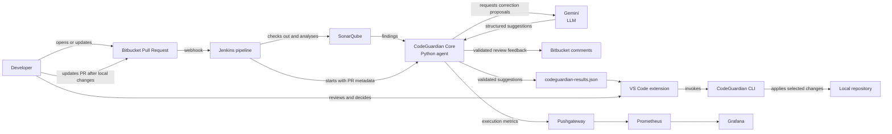

# CodeGuardian

CodeGuardian is an AI-assisted code review system developed as a Final Degree Project. It connects static analysis, CI/CD automation and controlled developer review in a single workflow.

The system addresses a common limitation of static-analysis tools: SonarQube can detect issues in a software project, but interpreting and correcting those issues still requires considerable developer time. CodeGuardian coordinates the review process, prepares the relevant code context, generates correction proposals with Gemini, validates them and publishes the resulting feedback as review comments.

The developer remains responsible for the final decision. Suggestions are reviewed in Bitbucket or locally through the VS Code extension and command-line interface before they are applied.

## Project Structure

The project is organized into three repositories, integrated here as independent top-level directories:

| Directory | Responsibility |
| --- | --- |
| [`codeguardian-core`](codeguardian-core/) | Python agent, validation logic, Bitbucket synchronization, result export, CLI and VS Code extension |
| [`codeguardian-infra`](codeguardian-infra/) | Docker-based environment with Jenkins, SonarQube, Prometheus, Pushgateway and Grafana |
| [`sample-mixed`](sample-mixed/) | Controlled Java and Python project used for testing and end-to-end demonstrations |

The original repository histories are preserved in the Git history of this unified repository.

## How It Works

1. A developer creates or updates a pull request in Bitbucket.
2. Bitbucket triggers the Jenkins pull-request pipeline.
3. Jenkins checks out the source code and identifies the project type.
4. SonarQube analyses the project and reports code-quality issues.
5. Jenkins starts the CodeGuardian Python agent with the pull-request metadata.
6. The agent retrieves and normalizes the findings, then locates the affected code.
7. Related findings are grouped and the required source context is sent to Gemini.
8. Gemini returns structured correction proposals.
9. CodeGuardian checks that each proposal is applicable to the current source and validates the generated replacement.
10. Valid suggestions are synchronized as inline comments in Bitbucket.
11. Validated suggestions can also be exported to `codeguardian-results.json`.
12. The VS Code extension invokes the CLI so the developer can review and apply selected changes locally.
13. Execution metrics are sent to Pushgateway and exposed through Prometheus and Grafana.

## Architecture

The following diagram summarizes the automated and manual parts of the workflow:



For a rendered version, the repository also includes the original workflow diagram at [`codeguardian-core/docs/Diagrams/workflow/workflow.png`](codeguardian-core/docs/Diagrams/workflow/workflow.png), with its editable source in [`workflow.mmd`](codeguardian-core/docs/Diagrams/workflow/workflow.mmd).

## Main Components

### CodeGuardian Core

The core agent is the orchestration layer. It reads the Jenkins pull-request contract, obtains SonarQube findings, prepares context for the language model, validates generated replacements and synchronizes comments with Bitbucket.

It also provides:

- issue normalization and deduplication;
- scope detection and batching by function or method;
- Python syntax validation;
- Maven compilation validation when a `pom.xml` is present;
- optional optimization review for changed scopes;
- incremental comment synchronization;
- export of validated suggestions and execution metrics.

The agent uses the Atlassian MCP integration to read pull-request information and comments. Bitbucket REST API calls are used where direct control is required for inline comment synchronization.

### Jenkins and SonarQube

Jenkins is the CI/CD orchestrator. Its pipeline is focused on pull requests, detects the project type, runs the appropriate SonarQube scanner path and launches the external CodeGuardian agent.

SonarQube is the static-analysis engine. It detects code-quality and security findings; it does not generate the final correction. CodeGuardian consumes those findings and turns the relevant ones into validated proposals.

### VS Code Extension and CLI

The extension provides the local review interface. The CLI performs the file-level operations: listing suggestions, checking whether the original code still matches the current file and applying selected replacements.

Applications are recorded as local transactions so that Undo can restore the previous file state, including related edits captured by the transaction mechanism.

### Observability

The infrastructure exports metrics such as analysis latency, token usage, cache activity, SonarQube findings, generated and discarded suggestions, and Bitbucket comment synchronization results.

Prometheus collects the metrics and Grafana displays them in dashboards. Pushgateway is used because each CodeGuardian execution is a short-lived process.

## Running the Demonstration

The complete local environment is documented in [`codeguardian-infra/docs/end-to-end-demo.md`](codeguardian-infra/docs/end-to-end-demo.md).

The main command is:

```bash
cd codeguardian-infra
docker compose up -d --build
```

The local services are available at:

| Service | URL |
| --- | --- |
| Jenkins | <http://localhost:8080> |
| SonarQube | <http://localhost:9000> |
| Prometheus | <http://localhost:9090> |
| Pushgateway | <http://localhost:9091> |
| Grafana | <http://localhost:3000> |

The demonstration target is `sample-mixed`. It contains controlled Java and Python findings so that the complete flow can be shown from pull-request creation to local correction and a subsequent pipeline execution.

## Configuration and Credentials

Credentials must be configured in Jenkins or supplied through the environment. Typical variables include:

```text
SONARQUBE_AUTH_TOKEN
LLM_AUTH_TOKEN
BITBUCKET_EMAIL
BITBUCKET_API_TOKEN
ATLASSIAN_MCP_AUTH_HEADER
```

Secrets are intentionally not stored in this repository. The exact configuration, pipeline contract and integration details are documented in [`codeguardian-core/README.md`](codeguardian-core/README.md) and [`codeguardian-infra/README.md`](codeguardian-infra/README.md).

## Validation and Tests

The core repository contains automated unit tests for input parsing, issue normalization, patch applicability, syntax and build validation, comment synchronization, performance review, metrics aggregation and SonarQube result parsing.

Run them from the core directory with:

```bash
cd codeguardian-core
pytest -q
```

The end-to-end demonstration additionally verifies the integration between Jenkins, SonarQube, CodeGuardian, Bitbucket, the local tools and the observability stack.

## Scope and Limitations

- Generated suggestions are proposals; the developer retains the final decision.
- Python replacements receive syntax validation, while Java projects with Maven can be checked with `mvn compile` when the project contains a `pom.xml`.
- Other ecosystems use applicability validation by default rather than compilation or test execution.
- Optimization review is optional and does not replace profiling, benchmarks or project tests.
- Automated unit tests focus mainly on the internal core behaviour; external-service integration is covered by the controlled demonstration environment.

## Documentation

- [Core documentation](codeguardian-core/docs/architecture.md)
- [Agent behaviour](codeguardian-core/docs/agent.md)
- [Validation strategy](codeguardian-core/docs/validation.md)
- [Bitbucket synchronization](codeguardian-core/docs/bitbucket-sync.md)
- [Jenkins pipeline](codeguardian-core/docs/pipeline.md)
- [Metrics](codeguardian-core/docs/metrics.md)
- [VS Code and CLI assistant](codeguardian-core/docs/ide-assistant.md)
- [End-to-end demonstration](codeguardian-infra/docs/end-to-end-demo.md)
