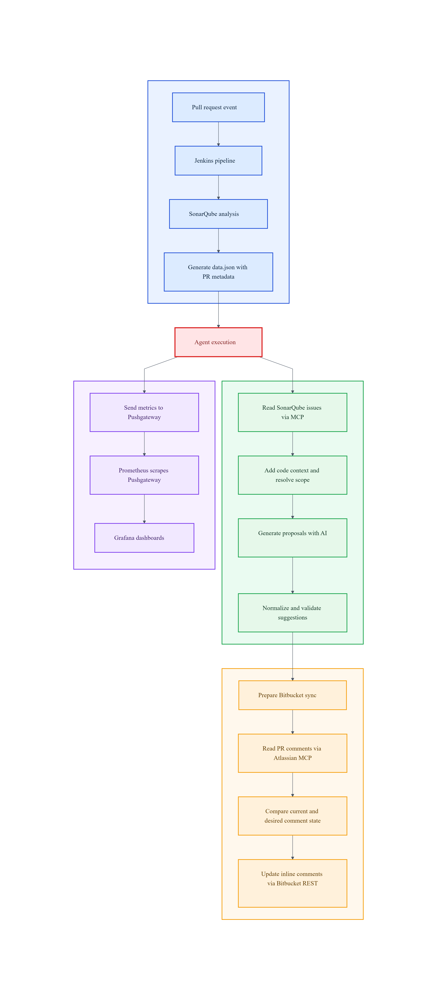

# CodeGuardian Core

## Summary

CodeGuardian is an automated pull request review assistant designed for CI/CD environments.
SonarQube performs issue detection, the agent transforms and validates findings, and AI proposes concrete code fixes.
Its goal is to transform static analysis findings into safe code-fix suggestions and publish them as inline comments in Bitbucket.

This repository contains the main agent logic in `agent.py` and the technical documentation in the `docs/` folder.

## Repository structure

- `agent.py`: main execution and orchestration logic.
- `docs/`: architecture, pipeline, validation, synchronization, and metrics documentation.
- `requirements.txt`: Python dependencies for the agent runtime.

## Core design

The system clearly separates detection, generation, and publication:

- SonarQube detects problems.
- The agent decides what to process, validates results, and orchestrates the workflow.
- AI proposes concrete code changes.
- Bitbucket displays the final feedback inside the pull request.

This separation reduces operational risk compared to direct "LLM-only" approaches without validation barriers.

## End-to-end flow

1. A pull request triggers the Jenkins pipeline.
2. Jenkins runs SonarQube analysis on the repository under review.
3. Jenkins builds a PR-context JSON file and executes `agent.py`.
4. The agent queries SonarQube through MCP and receives findings in JSON format.
5. The agent filters, enriches, and groups findings by code scope.
6. AI generates fix proposals per batch.
7. The agent normalizes and validates each proposal.
8. Valid proposals are synchronized as inline comments in Bitbucket.
9. Execution metrics are exported to Prometheus Pushgateway.

## JSON contracts in the system

CodeGuardian uses two different JSON contracts:

1. Pipeline input JSON (Jenkins -> agent)

- PR metadata JSON with:
  - `project_key`
  - `pr_id`
  - `repo_slug`
  - `workspace`
- It is consumed by the agent execution using the PR metadata input contract.

2. SonarQube findings JSON (SonarQube MCP -> agent)

- The agent invokes the SonarQube MCP tool.
- SonarQube returns findings in a JSON payload.
- The agent parses, cleans, and prioritizes that JSON before calling the model.

## Bitbucket integration architecture

Bitbucket integration is split by responsibility:

- Pull request comment reading: Atlassian Rovo MCP.
- Inline comment creation and deletion: Bitbucket REST API.

This mixed model is intentionally chosen to maximize control and reliability over the inline comment lifecycle.

## Reliability mechanisms

The agent includes safety barriers before publishing suggestions:

- Strict prompt and response-format rules.
- Issue normalization and deduplication.
- Applicability check: `original_code` must match real repository content.
- Python syntax validation with `ast.parse()`.
- Incremental comment synchronization (create, reuse, delete) using content signatures.

## Observability

Analysis metrics are exported to Pushgateway, including:

- analysis latency,
- prompt tokens,
- response tokens,
- total tokens,
- last execution timestamp.

In addition, the agent logs:

- cache behavior,
- validation summary,
- inline synchronization summary.

This makes the execution easier to monitor, evaluate, and troubleshoot across builds.

## Runtime requirements

Main environment variables:

- `SONARQUBE_AUTH_TOKEN`
- `LLM_AUTH_TOKEN`
- `BITBUCKET_EMAIL`
- `BITBUCKET_API_TOKEN`
- `ATLASSIAN_MCP_AUTH_HEADER`

Additional optional variables are available for cache configuration, endpoints, and grouping behavior.

## Minimal agent invocation

This is a minimal invocation example, not a full local quickstart.
Successful execution still depends on valid credentials, reachable SonarQube and Bitbucket services,
working MCP/REST integrations, and a repository context that matches the provided PR metadata.

1. Install dependencies from `requirements.txt`.
2. Configure required environment variables.
3. Create a pull-request input JSON (this is not the SonarQube findings JSON), for example:

```json
{
  "project_key": "my-project",
  "pr_id": "123",
  "repo_slug": "my-repo",
  "workspace": "my-workspace"
}
```

4. Run the agent entry point.

## Workflow diagram


## Technical documentation

- [docs/architecture.md](docs/architecture.md)
- [docs/agent.md](docs/agent.md)
- [docs/validation.md](docs/validation.md)
- [docs/bitbucket-sync.md](docs/bitbucket-sync.md)
- [docs/pipeline.md](docs/pipeline.md)
- [docs/metrics.md](docs/metrics.md)

## Current scope and limitations

- The strongest validation is currently implemented for Python (syntax parsing).
- For other ecosystems, applicability validation is used, without compilation or tests by default.
- Part of scope detection in brace-based languages is heuristic.

## Status

The repository provides a stable baseline for automated pull request review in CI/CD environments, with an emphasis on safe publication, traceability, and incremental synchronization.